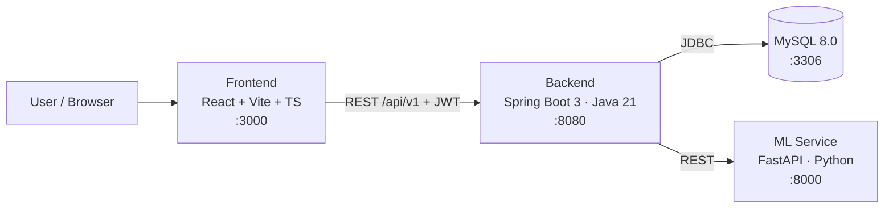

# MindMirror AI

**An Explainable Mental Health Analytics & Personalized Well‑being Platform**

MindMirror AI lets users reflect through journals, questionnaires, and social‑media text, then delivers
AI‑driven insights — mood predictions, **explainable** mental‑health signals, trigger detection, a visual
"mental mirror", personalized recovery plans, analytics dashboards, and exportable PDF reports.

> ⚠️ **Not a medical device.** MindMirror AI is for educational and self‑reflection purposes only. It does
> not diagnose conditions or provide crisis care. The in‑app Emergency Help section lists informational
> helpline resources only.

---

## Table of Contents
- [Architecture](#architecture)
- [Tech Stack](#tech-stack)
- [Feature Modules](#feature-modules)
- [Machine Learning](#machine-learning)
- [Project Structure](#project-structure)
- [Getting Started](#getting-started)
- [Environment Variables](#environment-variables)
- [API Overview](#api-overview)
- [Testing](#testing)

---

## Architecture

A polyglot monorepo with three application services plus MySQL:



- **Backend** follows a hexagonal / clean architecture: `domain` (entities, repositories),
  `application` (use‑case ports + services), `infrastructure` (JPA, security, ML/email adapters),
  and `interfaces/api/v1` (REST controllers + DTOs).
- **Frontend** uses a feature/layout separation with React Query for server state, a JWT‑aware API
  client, and an auth + theme context.
- **ML service** exposes analysis, prediction, trigger detection, weekly insights, and model metrics.

---

## Tech Stack

| Layer | Technologies |
|-------|--------------|
| **Frontend** | React 18, TypeScript, Vite, Tailwind CSS (dark mode), React Router, React Query, Chart.js + react‑chartjs‑2, Framer Motion, jsPDF + html2canvas |
| **Backend** | Spring Boot 3.3 (Java 21), Spring Web / Security / Data JPA / Validation, JJWT, Flyway, Lombok, Maven |
| **ML Service** | FastAPI, Uvicorn, Pydantic, scikit‑learn (TF‑IDF + Random Forest), joblib; optional SHAP, Transformers/Torch (pluggable) |
| **Database** | MySQL 8.0 (Flyway migrations `V1`–`V7`) |
| **Ops** | Docker Compose, GitHub Actions CI |

---

## Feature Modules

| # | Module | Highlights |
|---|--------|-----------|
| 1 | **Authentication** | Register, login, JWT access/refresh, email verification, forgot/reset password |
| 2 | **Dashboard** | Welcome, wellness score, journal streak, goals, quick actions |
| 3 | **Assessment** | Three methods — **Questionnaire**, **Journal**, **Social Media** text analysis |
| 4 | **AI Prediction** | Mental‑health state prediction + confidence (TF‑IDF + Random Forest) |
| 5 | **Explainable AI** | Per‑feature contribution breakdown ("why this prediction") |
| 6 | **Trigger Detection** | Keyword/category trigger extraction with intensity |
| 7 | **Virtual Mental Mirror** | Data‑driven radar, circular progress, and wellness metrics |
| 8 | **Recovery Center** | Personalized recovery actions with completion tracking |
| 9 | **Analytics Dashboard** | Radar, **heatmap calendar**, **emotion timeline**, mood/weekly trends, distributions |
| 10 | **Reports** | Live report preview + **PDF export** (jsPDF/html2canvas) |
| 11 | **Admin Panel** | Overview stats, **user management**, **model‑accuracy comparison**, **feedback review** |

**Standout UX:** Dark/Light theme toggle · Mood streak counter · Weekly wellness goals ·
Daily journal reminder (browser notifications) · Emergency Help resources · Feedback & Rating ·
Responsive design.

---

## Machine Learning

The ML module implements the classic pipeline **Text Cleaning → Tokenization → TF‑IDF → Random Forest**,
with a **Logistic Regression baseline** for an accuracy comparison (surfaced in the Admin panel).

- **Training:** `python -m app.train` builds the model from a seed dataset and writes
  `models/pipeline.joblib` + `models/metrics.json`. The Docker image trains at build time.
- **Explainability:** predictions return a normalized per‑feature contribution breakdown. SHAP is used
  when installed, falling back to Random Forest feature importances.
- **Graceful fallback:** if the trained model or heavy dependencies are unavailable, the service uses a
  transparent lexicon/heuristic baseline so it always runs.
- **Pluggable transformers:** the emotion/prediction interfaces allow dropping in XLNet/RoBERTa later.

Labels: `normal`, `stress`, `anxiety`, `depression`.

---

## Project Structure

```
MindMirrorAI/
├── docker-compose.yml
├── .env.example
├── backend/            # Spring Boot (Java 21) — hexagonal architecture
│   ├── src/main/java/com/project/mentalhealth/
│   │   ├── domain/{model,repository}
│   │   ├── application/{ports/in,ports/out,service}
│   │   ├── infrastructure/{persistence,security,ml,email}
│   │   ├── interfaces/api/v1/{auth,journal,questionnaire,mood,trigger,
│   │   │   recovery,report,analysis,analytics,goal,feedback,profile,admin}
│   │   └── shared/
│   └── src/main/resources/{application.yml,application-dev.yml,application-prod.yml}
├── frontend/           # React + TS + Vite + Tailwind
│   └── src/{pages,components,context,lib,routes}
├── ml-service/         # FastAPI ML service
│   └── app/{main,analysis,preprocessing,ml_models,train,seed_data,schemas}.py
├── database/schema/init.sql
├── docs/               # project documentation and analysis notes
└── .github/workflows/ci.yml
```

---

## Getting Started

**Prerequisites:** Node.js 18+, Java 21 + Maven, Python 3.10+, MySQL 8 (or Docker).

### Option A — Docker Compose (all services)

```bash
cp .env.example .env   # set JWT_SECRET and passwords
docker compose up --build
```
- Frontend (Docker/Nginx) → http://localhost:5173  · Backend → http://localhost:8080  · ML → http://localhost:8000
- For local frontend development, Vite serves the app on http://localhost:3000.

### Option B — Run services individually

```bash
# Frontend  (http://localhost:3000)
cd frontend && npm install && npm run dev

# Backend   (http://localhost:8080)  — requires JDK 21 + Maven + MySQL
cd backend && mvn spring-boot:run

# ML service (http://localhost:8000)
cd ml-service
python -m venv .venv && .venv\Scripts\activate   # Windows (use source .venv/bin/activate on macOS/Linux)
pip install -r requirements.txt
python -m app.train        # build the model artifact
uvicorn app.main:app --reload --host 0.0.0.0 --port 8000
```

**Health checks:** Backend `GET /api/v1/auth/health` & `/actuator/health` · ML `GET /health`

---

## Environment Variables

Copy `.env.example` → `.env`. Key values:

| Variable | Purpose |
|----------|---------|
| `MYSQL_ROOT_PASSWORD`, `MYSQL_DATABASE` | Database credentials |
| `JWT_SECRET` (**required**) | Long, random signing secret (≥ 32 chars) |
| `JWT_EXPIRATION_MS`, `JWT_REFRESH_EXPIRATION_MS` | Token lifetimes |
| `SPRING_DATASOURCE_*` | Backend datasource (non‑Docker) |
| `ML_SERVICE_BASE_URL` | Backend → ML service URL |
| `VITE_API_BASE_URL` | Frontend → backend API base |

---

## API Overview

Base path: `/api/v1`

| Area | Endpoints |
|------|-----------|
| Auth | `POST /auth/register` · `POST /auth/login` · `POST /auth/refresh` · `POST /auth/forgot-password` · `POST /auth/reset-password` · `POST /auth/verify-email` |
| Journal / Mood | `GET,POST /journal` · `GET,POST /mood` |
| Questionnaire | `POST /questionnaire` |
| Analysis | `POST /analysis/journal` · `POST /analysis/social` · `GET /analysis/mood-prediction` · `GET /analysis/model-metrics` |
| Analytics | `GET /analytics/overview` · `GET /analytics/weekly-insights` |
| Triggers / Recovery / Reports | `GET,POST /triggers` · `GET /recovery` · `GET /reports/summary` |
| Goals / Feedback / Profile | `GET,POST /goals` · `POST /feedback` · `GET /me/profile` |
| Admin | `GET /admin/overview` · `GET /admin/users` · `PATCH /admin/users/{id}/enabled` · `GET /admin/feedback` · `GET /admin/model-metrics` |

ML service (internal): `POST /analyze/journal` · `POST /analyze/social` · `POST /predict/mood` ·
`POST /detect/triggers` · `POST /insights/weekly` · `GET /models/metrics` · `GET /health`

---

## Testing

```bash
# Frontend
cd frontend && npm run test        # Vitest

# ML service
cd ml-service && python -m pytest  # pytest

# Backend
cd backend && mvn test             # JUnit
```

CI runs on GitHub Actions (`.github/workflows/ci.yml`).
