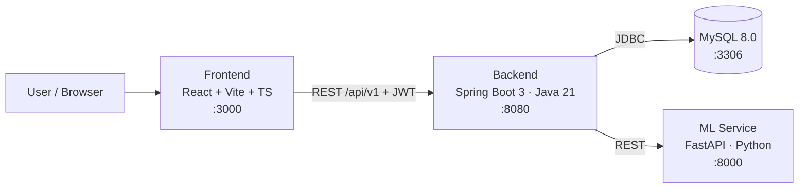

# MindMirror AI

**An Explainable Mental Health Analytics & Personalized Well‑being Platform**

MindMirror AI lets users reflect through journals, questionnaires, and social‑media text, then delivers
AI‑driven insights — mood predictions, **explainable** mental‑health signals, trigger detection, a visual
"mental mirror", personalized recovery plans, analytics dashboards, and exportable PDF reports.

> ⚠️ **Not a medical device.** MindMirror AI is for educational and self‑reflection purposes only. It does
> not diagnose conditions or provide crisis care. The in‑app Emergency Help section lists informational
> helpline resources only.

---

## Table of Contents
- [Architecture](#architecture)
- [Tech Stack](#tech-stack)
- [Feature Modules](#feature-modules)
- [Machine Learning](#machine-learning)
- [Project Structure](#project-structure)
- [Getting Started](#getting-started)
- [Environment Variables](#environment-variables)
- [API Overview](#api-overview)
- [Testing](#testing)

---

## Architecture

A polyglot monorepo with three application services plus MySQL:



- **Backend** follows a hexagonal / clean architecture: `domain` (entities, repositories),
  `application` (use‑case ports + services), `infrastructure` (JPA, security, ML/email adapters),
  and `interfaces/api/v1` (REST controllers + DTOs).
- **Frontend** uses a feature/layout separation with React Query for server state, a JWT‑aware API
  client, and an auth + theme context.
- **ML service** exposes analysis, prediction, trigger detection, weekly insights, model metrics, and a
  versioned training/registry API. It is **stateless and internal-only** — it owns *models*, the backend
  owns *user data and orchestration*, and the ML service never touches MySQL.

**Write path:** saving a journal entry inserts a `PENDING` analysis row and returns immediately; a
background worker calls the ML service after the transaction commits and derives mood/trigger signals
from the result. An ML outage therefore never fails a save — the row is retried later.

---

## Tech Stack

| Layer | Technologies |
|-------|--------------|
| **Frontend** | React 18, TypeScript, Vite, Tailwind CSS (dark mode), React Router, React Query, Chart.js + react‑chartjs‑2, Framer Motion, jsPDF + html2canvas |
| **Backend** | Spring Boot 3.3 (Java 21), Spring Web / Security / Data JPA / Validation, JJWT, Flyway, Lombok, Maven |
| **ML Service** | FastAPI, Uvicorn, Pydantic, scikit‑learn (TF‑IDF + Random Forest), joblib; optional SHAP, Transformers/Torch (pluggable) |
| **Database** | MySQL 8.0 (Flyway migrations `V1`–`V14`) |
| **Ops** | Docker Compose, GitHub Actions CI |

---

## Feature Modules

| # | Module | Highlights |
|---|--------|-----------|
| 1 | **Authentication** | Register, login, JWT access/refresh, email verification, forgot/reset password |
| 2 | **Dashboard** | Wellness score, streak, goals, mood week, recent AI insights — all derived from the signed-in user's own data, with empty states when data is missing |
| 3 | **Assessment** | Three methods — **Questionnaire**, **Journal**, **Social Media** text analysis |
| 4 | **AI Prediction** | Mental‑health state prediction + confidence (TF‑IDF + Random Forest) |
| 5 | **Explainable AI** | Per‑feature contribution breakdown ("why this prediction") |
| 6 | **Trigger Detection** | Keyword/category trigger extraction with intensity |
| 7 | **Virtual Mental Mirror** | Data‑driven radar, circular progress, and wellness metrics |
| 8 | **Recovery Center** | Personalized recovery actions with completion tracking |
| 9 | **Analytics Dashboard** | Radar, **heatmap calendar**, **emotion timeline**, mood/weekly trends, distributions |
| 10 | **Reports** | Live report preview + **PDF export** (jsPDF/html2canvas) |
| 11 | **Social Accounts** | Connect accounts, import posts/content for analysis, and review the resulting insights |
| 12 | **Admin Panel** | Overview stats, **user management**, **model‑accuracy comparison**, **feedback review**, **retraining & model deployment** (versions, quality gate, promote/rollback) |
| 13 | **Personalized Mindset** | Composite explainable score calibrated against each user's own baseline, reported as deviation ("1.4σ below your usual range") |

**Recently shipped**

- **Persisted ML analysis** — every journal entry is analyzed in the background and stored, with mood
  and trigger signals derived from it, so ordinary journaling populates the whole app.
- **A data-driven dashboard** — every figure traces to something the user did, with honest empty states
  where data is missing instead of plausible-looking placeholders.
- **A hardened ML client** — timeouts, one retry, and a circuit breaker, so ML downtime degrades the
  product instead of breaking it.
- **Deliberate data collection** — daily check-in, onboarding, writing prompts, trigger confirmation,
  and timezone-aware day buckets.
- **Prediction feedback** — "was this right?" captures the corrections a retraining run learns from.
- **A full retraining loop** — consent-gated export → versioned training → quality gate → human
  promotion → hot-swap → rollback, every step audited.
- **A personalized mindset score** — one composite, explainable number that the dashboard, mirror and
  reports all agree on, calibrated against each user's own baseline.

**Data collection & consent:** daily buckets (streaks, heatmaps, "one check-in per day") use each
user's own timezone. Using entries as **training data** is a separate, explicit, default-off opt-in,
revocable in Settings; declining it changes nothing about how the app works.

**Standout UX:** Dark/Light theme toggle · Mood streak counter · Weekly wellness goals ·
Daily journal reminder (browser notifications) · Emergency Help resources · Feedback & Rating ·
Responsive design.

---

## Machine Learning

The ML module implements the classic pipeline **Text Cleaning → Tokenization → TF‑IDF → Random Forest**,
with a **Logistic Regression baseline** for an accuracy comparison (surfaced in the Admin panel).

- **Training:** `python -m app.train` builds the model from a GoEmotions-style synthetic corpus and writes
  `models/pipeline.joblib` + `models/metrics.json`. The Docker image trains at build time.
- **Dataset profile:** the synthetic source corpus covers 27 emotion labels and ~58k comments,
  then maps to MindMirror's 4 prediction states for deployment compatibility.
- **Scale control:** set `ML_SYNTHETIC_TRAINING_SAMPLES` (default `58320`) to trade off
  training speed vs corpus size. For faster local iteration, set it to `12000`.
- **Runtime visibility:** on startup, the ML service logs dataset mode (`full`/`reduced`) and
  active sample counts. The same summary is returned by `GET /health`.
- **Explainability:** predictions return a normalized per‑feature contribution breakdown. SHAP is used
  when installed, falling back to Random Forest feature importances.
- **Graceful fallback:** if the trained model or heavy dependencies are unavailable, the service uses a
  transparent lexicon/heuristic baseline so it always runs.
- **Admin observability:** model metrics now include emotion-label coverage and dataset profile metadata,
  and this is surfaced in the Admin Analytics UI.
- **Retraining from user data:** consented, PII-scrubbed corrections are merged with the seed corpus
  (`app/training/corpus.py`), trained into a **versioned** artifact, and evaluated against a **frozen
  seed holdout** so successive versions stay comparable.
- **Quality gate:** a candidate is promotable only if it clears every check in `app/training/quality.py` —
  no accuracy/F1 regression, no class below an F1 floor, enough user examples overall and per class, and
  no large shift in predicted-class distribution. Failing versions need an explicit, audited override.
- **Versioned registry:** `models/versions/<version>/` plus a `registry.json` active pointer. Promotion
  hot-swaps the live model without a restart, and any earlier version can be rolled back to.
- **Promotion is always a human decision** — training produces a candidate, never a deployment.
- **Pluggable transformers:** the emotion/prediction interfaces allow dropping in XLNet/RoBERTa later.

> **On "fine-tuning":** TF-IDF + Random Forest cannot be incrementally fine-tuned — sklearn tree
> ensembles have no `partial_fit`. What runs here is **periodic retraining on an augmented corpus**
> (synthetic seed + user labels), which achieves the same goal. True incremental learning would need an
> `SGDClassifier` path, and transformer fine-tuning remains a later phase behind the same interface.

Prediction labels: `normal`, `stress`, `anxiety`, `depression`.

---

## Project Structure

```
MindMirrorAI/
├── docker-compose.yml
├── .env.example
├── backend/            # Spring Boot (Java 21) — hexagonal architecture
│   ├── src/main/java/com/project/mentalhealth/
│   │   ├── domain/{model,repository}
│   │   ├── application/{ports/in,ports/out,service}
│   │   ├── infrastructure/{persistence,security,ml,email,async}
│   │   ├── interfaces/api/v1/{auth,journal,questionnaire,mood,trigger,checkin,
│   │   │   recovery,report,analysis,analytics,goal,feedback,profile,admin,social}
│   │   └── shared/
│   └── src/main/resources/
│       ├── application.yml
│       └── db/migration/         # Flyway V1–V14
├── frontend/           # React + TS + Vite + Tailwind
│   └── src/
│       ├── pages/
│       ├── components/{admin,analysis,checkin,mindset,onboarding,triggers,charts,layout,ui,feedback}
│       └── lib/                  # API hooks + pure helpers (unit tested)
├── ml-service/         # FastAPI ML service
│   ├── app/{main,analysis,preprocessing,ml_models,train,seed_data,schemas}.py
│   ├── app/training/{corpus,quality,registry,runner}.py   # retraining pipeline
│   └── models/                   # versioned artifacts + registry.json (gitignored)
├── database/schema/init.sql
├── docs/               # project documentation and analysis notes
├── plans/              # implementation plans
└── .github/workflows/ci.yml
```

---

## Getting Started

**Prerequisites:** Node.js 18+, Java 21 + Maven, Python 3.10+, MySQL 8 (or Docker).

### Option A — Docker Compose (all services)

```bash
cp .env.example .env   # set JWT_SECRET and passwords
docker compose up --build
```
- Frontend (Docker/Nginx) → http://localhost:5173  · Backend → http://localhost:8080  · ML → http://localhost:8000
- For local frontend development, Vite serves the app on http://localhost:3000.

### Option B — Run services individually

```bash
# Frontend  (http://localhost:3000)
cd frontend && npm install && npm run dev

# Backend   (http://localhost:8080)  — requires JDK 21 + Maven + MySQL
cd backend && mvn spring-boot:run

# ML service (http://localhost:8000)
cd ml-service
python -m venv .venv && .venv\Scripts\activate   # Windows (use source .venv/bin/activate on macOS/Linux)
pip install -r requirements.txt
python -m app.train        # build the model artifact
uvicorn app.main:app --reload --host 0.0.0.0 --port 8000
```

**Health checks:** Backend `GET /api/v1/auth/health` & `/actuator/health` · ML `GET /health`

---

## Environment Variables

Copy `.env.example` → `.env`. Key values:

| Variable | Purpose |
|----------|---------|
| `MYSQL_ROOT_PASSWORD`, `MYSQL_DATABASE` | Database credentials |
| `JWT_SECRET` (**required**) | Long, random signing secret (≥ 32 chars) |
| `JWT_EXPIRATION_MS`, `JWT_REFRESH_EXPIRATION_MS` | Token lifetimes |
| `SPRING_DATASOURCE_*` | Backend datasource (non‑Docker) |
| `ML_SERVICE_BASE_URL` | Backend → ML service URL |
| `ML_SYNTHETIC_TRAINING_SAMPLES` | Training subset size from synthetic corpus (default `58320`) |
| `VITE_API_BASE_URL` | Frontend → backend API base |
| `ML_TRAINING_TOKEN` | Shared secret guarding the ML service's `/train` and `/models/promote` endpoints |
| `ML_TRAINING_HASH_SALT` | Salt used to pseudonymize exported training rows (**set a real value in production**) |
| `ML_TRAINING_SCHEDULED` | Enable the weekly training run (default `false`; it stops at the gate either way) |
| `ML_TRAINING_MAX_PER_USER` | Cap on exported examples per user (default `200`) |
| `ANALYSIS_DERIVE_MOOD` / `ANALYSIS_DERIVE_TRIGGERS` | Whether journal analysis writes derived mood/trigger entries (default `true`) |
| `ML_CONNECT_TIMEOUT_MS`, `ML_READ_TIMEOUT_MS`, `ML_CB_*` | ML client timeouts and circuit-breaker tuning |
| `BASELINE_CRON` | When to recompute per-user baselines (default `0 30 2 * * *`) |

---

## API Overview

Base path: `/api/v1`

| Area | Endpoints |
|------|-----------|
| Auth | `POST /auth/register` · `POST /auth/login` · `POST /auth/refresh` · `POST /auth/forgot-password` · `POST /auth/reset-password` · `POST /auth/verify-email` |
| Journal / Mood | `GET,POST /journal` · `GET,POST /mood` · `GET,POST /checkin` |
| Questionnaire | `POST /questionnaire` |
| Analysis | `POST /analysis/journal` · `POST /analysis/social` · `GET /analysis/results` · `GET /analysis/results/{id}` · `GET /analysis/journal/{entryId}` · `GET /analysis/mood-prediction` · `GET /analysis/model-metrics` · `GET /analysis/health` · `POST,GET /analysis/results/{id}/feedback` |
| Analytics | `GET /analytics/dashboard` · `GET /analytics/mindset` · `GET /analytics/overview` · `GET /analytics/weekly-insights` |
| Triggers / Recovery / Reports | `GET,POST /triggers` · `GET /triggers/pending` · `PATCH /triggers/{id}/confirm` · `PATCH /triggers/{id}/dismiss` · `GET /recovery` · `GET /reports/summary` |
| Goals / Feedback / Profile | `GET,POST /goals` · `POST /feedback` · `GET /me/profile` · `PATCH /me/profile` · `POST /me/password` · `GET,PATCH /me/preferences` |
| Social Accounts | `GET /social-accounts` · `POST /social-accounts/connect` · `DELETE /social-accounts/{id}` · `POST /social-accounts/import` |
| Admin | `GET /admin/overview` · `GET /admin/users` · `PATCH /admin/users/{id}/enabled` · `GET /admin/feedback` · `GET /admin/model-metrics` · `GET /admin/prediction-feedback` · `GET /admin/prediction-feedback/stats` · `GET /admin/training-data/summary` · `POST /admin/models/retrain` · `GET /admin/models/runs` · `GET /admin/models/versions` · `POST /admin/models/promote` · `POST /admin/models/rollback` |

ML service (internal): `POST /analyze/journal` · `POST /analyze/social` · `POST /analyze/batch` ·
`POST /predict/mood` · `POST /detect/triggers` · `POST /insights/weekly` · `GET /models/metrics` · `GET /health` ·
`POST /train/run` · `GET /train/status/{id}` · `GET /models/versions` · `GET /models/active` ·
`POST /models/promote` · `POST /models/rollback`

Training and promotion endpoints require the `X-Training-Token` header (`ML_TRAINING_TOKEN`).

Analysis responses now carry detected `triggers` and a `model_version` alongside the prediction, so a
caller needs one round trip rather than two and every stored result is traceable to the model that
produced it.

`GET /models/metrics` includes label sets plus dataset profile (source size, training samples used).

`GET /health` returns service status and runtime dataset summary:

```json
{
  "status": "ok",
  "dataset": {
    "mode": "full",
    "training_samples": 58320,
    "source_samples": 58320,
    "emotion_label_count": 28
  }
}
```

---

## Testing

```bash
# Frontend — 56 tests
cd frontend && npm run test        # Vitest

# ML service — 37 tests
cd ml-service && python -m pytest  # pytest

# Backend — 79 tests
cd backend && mvn test             # JUnit
```

Backend and ML tests cover the parts that must not drift: the promotion gate's conditions, corpus
assembly and per-user caps, consent filtering and PII scrubbing, the composite score's weight
renormalization and its refusal to score on thin data, timezone-aware day bucketing, and the
analysis retry path when the ML service is down.

CI runs on GitHub Actions (`.github/workflows/ci.yml`).
