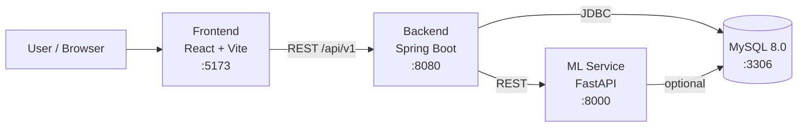

# MindMirrorAI — Project Analysis

> **Repository:** `Bavasurthi05/MindMirrorAI`
> **Product name:** Mental Health Analytics Platform
> **Analysis date:** 2026-07-24
> **Status:** Early-stage skeleton — rich frontend UI, minimal backend/ML logic

---

## 1. Executive Summary

MindMirrorAI is a full-stack, **AI-powered mental health analytics platform**. Its goal is to let users journal, complete questionnaires, and receive AI-driven insights (mood timelines, trigger analytics, recovery plans, weekly wellness summaries) with an administrative view for monitoring.

The repository is organized as a **polyglot monorepo** with four services:

| Service | Technology | Current State |
|---------|-----------|---------------|
| **frontend/** | React 18 + TypeScript + Vite + Tailwind | Well-developed UI: many pages, layouts, and reusable components |
| **backend/** | Spring Boot 3.3.5 (Java 21) | Skeleton: hexagonal package structure, auth health endpoint only |
| **ml-service/** | FastAPI (Python) | Skeleton: single `/health` endpoint |
| **database/** | MySQL 8.0 | Minimal schema: `roles` and `users` tables |

The project README explicitly states: *"This repository contains the initial project skeleton and configuration only. Business logic and feature implementations are intentionally not included."* The analysis below confirms this — the **frontend is the most mature layer**, while backend and ML services are scaffolds awaiting implementation.

---

## 2. Architecture Overview

### 2.1 High-Level Diagram



### 2.2 Design Style

- **Backend** follows a **hexagonal / clean architecture** layout:
  - `domain/` — entities (`User`) and repository interfaces
  - `application/ports/in` & `application/ports/out` — use-case and outbound port interfaces
  - `infrastructure/` — persistence (JPA) and security (JWT, Spring Security)
  - `interfaces/api/v1` — REST controllers, DTOs, and common response wrappers
  - `shared/` — cross-cutting utilities and exception handling
- **Frontend** follows a **feature/layout separation**: `layout/`, `ui/`, `feedback/`, `auth/` components with a page-per-route structure.

---

## 3. Technology Stack

### 3.1 Frontend (`frontend/`)
- **React** `18.3.1` + **React DOM**
- **TypeScript** `5.6.3`
- **Vite** `5.4.10` (build/dev server)
- **Tailwind CSS** `3.4.15` + PostCSS + Autoprefixer
- **React Router DOM** `6.21.1` (client-side routing)
- **Chart.js** `3.9.1` + **react-chartjs-2** (data visualization)
- **Framer Motion** `11.11.0` (animations)

### 3.2 Backend (`backend/`)
- **Spring Boot** `3.3.5`, **Java 21**
- **Spring Web**, **Spring Security**, **Spring Data JPA**, **Validation**, **Actuator**
- **JJWT** `0.12.6` (JWT auth — api/impl/jackson)
- **MySQL Connector/J** (runtime)
- **Lombok** `1.18.36`
- Build: **Maven** with `spring-boot-maven-plugin`

### 3.3 ML Service (`ml-service/`)
- **FastAPI** `0.115.0` + **Uvicorn** `0.32.0`
- **Pydantic** `2.10.2`
- **Transformers** `4.46.1` + **Torch** `2.6.0` (NLP / deep learning)
- **scikit-learn** `1.5.3`
- **SHAP** `0.46.1` + **LIME** `0.2.0.1` (model explainability)
- **NumPy** `2.0.0`

### 3.4 Database (`database/`)
- **MySQL** `8.0`
- Schema seed: `database/schema/init.sql`

### 3.5 Orchestration
- **Docker Compose** `3.9` — defines `mysql`, `backend`, and `ml-service` services.

---

## 4. Directory / File Structure

```
MindMirrorAI/
├── docker-compose.yml          # Orchestrates mysql, backend, ml-service
├── README.md                   # Project overview & quick start
├── backend/                    # Spring Boot (Java 21) — hexagonal architecture
│   ├── pom.xml
│   └── src/main/
│       ├── java/com/project/mentalhealth/
│       │   ├── application/ports/{in,out}      # Use-case & outbound ports
│       │   ├── domain/{model,repository}        # User entity + repository
│       │   ├── infrastructure/{persistence/jpa,security}  # JPA base, JWT, Spring Security
│       │   ├── interfaces/api/v1/{auth,common}  # Controllers, DTOs, ApiResponse
│       │   └── shared/{exception,util}          # Global handler, utilities
│       └── resources/
│           ├── application.yml, application-dev.yml, application-prod.yml
├── database/
│   └── schema/init.sql          # roles + users tables
├── frontend/                    # React + TS + Vite + Tailwind
│   └── src/
│       ├── App.tsx              # Route definitions
│       ├── main.tsx, index.css
│       ├── components/
│       │   ├── auth/            # AuthCard
│       │   ├── feedback/        # Alert, Toast, Spinner, Skeleton, ProgressBar, EmptyState
│       │   ├── layout/          # Public/Protected/Admin layouts, Sidebar, TopNav, Footer, etc.
│       │   └── ui/              # button, card, input, checkbox, radio, switch, dropdown, textarea
│       ├── lib/cn.ts            # className helper
│       ├── pages/               # Dashboard, Journal, Questionnaire, Mirror, MoodTimeline, etc.
│       │   └── auth/            # Login, Register, ForgotPassword, ResetPassword, EmailVerification
│       └── routes/index.tsx
└── ml-service/                  # FastAPI ML service
    ├── requirements.txt
    └── app/main.py              # /health endpoint
```

---

## 5. Feature Map (Planned vs. Implemented)

Derived from `frontend/src/App.tsx` routing. The **UI shells exist**; backend data/logic is largely pending.

| Route | Page | UI Present | Backend Support |
|-------|------|:----------:|:---------------:|
| `/` | Landing | ✅ | n/a |
| `/login`, `/register` | Auth entry | ✅ | ❌ (only `/auth/health`) |
| `/forgot-password`, `/reset-password` | Password recovery | ✅ | ❌ |
| `/verify-email` | Email verification | ✅ | ❌ |
| `/dashboard` | User dashboard | ✅ | ❌ |
| `/journal` | Journaling | ✅ | ❌ |
| `/questionnaire` | Questionnaire | ✅ | ❌ |
| `/mirror` | "Mirror" self-reflection | ✅ | ❌ |
| `/prediction-results` | AI prediction output | ⚠️ Placeholder | ❌ |
| `/trigger-analytics` | Trigger analysis | ✅ | ❌ |
| `/mood-timeline` | Mood timeline | ✅ | ❌ |
| `/weekly-insights` | Weekly summaries | ⚠️ Placeholder | ❌ |
| `/recommendations` | Recovery plan | ✅ | ❌ |
| `/reports` | Report preview | ✅ | ❌ |
| `/profile`, `/settings` | User settings | ⚠️ Placeholder | ❌ |
| `/admin`, `/admin/analytics` | Admin views | ✅ / ⚠️ | ❌ |

**Legend:** ✅ dedicated component · ⚠️ placeholder component · ❌ not implemented

---

## 6. Backend Deep-Dive

- **Entry point:** `MentalHealthBackendApplication.java` (note: a duplicate exists at both `com/project/` and `com/project/mentalhealth/` — see Issues §9).
- **Security** (`SecurityConfig.java`): CSRF disabled; permits `/api/v1/auth/health` and `/actuator/health`; all other requests require authentication. No JWT filter is wired into the chain yet — JWT dependencies are present but not integrated.
- **Domain model** (`User.java`): JPA entity with `firstName`, `lastName`, `email` (unique), `passwordHash`, `enabled`. Extends `BaseEntity`.
- **API layer:** `AuthController` currently only exposes a `GET /auth/health`. `ApiResponse<T>` and `PageResponse<T>` provide standardized response envelopes.
- **Config** (`application.yml`): externalized via environment variables; JPA `ddl-auto=validate`; JWT secret/expiration configurable; API base path `/api/v1`. Dev/prod profile YAMLs present.

### ⚠️ Schema / Entity Mismatch
The MySQL `users` table (`init.sql`) uses `username`, `full_name`, `role_id`, `password_hash` and integer PKs, while the JPA `User` entity uses `firstName`, `lastName`, `email`, `passwordHash` and a `Long id`. With `ddl-auto=validate`, **the app will fail to start against the provided schema** until they are reconciled.

---

## 7. ML Service Deep-Dive

- Single file `app/main.py` exposing `GET /health`.
- Heavy ML dependencies (Transformers, Torch, scikit-learn, SHAP, LIME) are declared, signaling intended capabilities:
  - **NLP** on journal text (sentiment/emotion classification).
  - **Predictive modeling** (mood/risk) via scikit-learn.
  - **Explainability** (SHAP/LIME) for transparent, trustworthy predictions — appropriate for a sensitive health domain.
- No models, inference endpoints, or backend↔ML integration exist yet.

---

## 8. Setup & Run Instructions

### Prerequisites
- Node.js 18+ / npm, Java 21 + Maven, Python 3.10+, MySQL 8 (or Docker).

### Local (per README)
```bash
# Frontend
cd frontend && npm install && npm run dev        # http://localhost:5173

# Backend
cd backend && mvn spring-boot:run                # http://localhost:8080

# ML service
cd ml-service && python -m venv .venv
.venv\Scripts\activate                           # Windows
pip install -r requirements.txt
uvicorn app.main:app --reload --host 0.0.0.0 --port 8000

# Database
mysql < database/schema/init.sql
```

### Docker Compose
```bash
docker compose up --build
```
> Note: `docker-compose.yml` does **not** define the frontend service; only `mysql`, `backend`, and `ml-service` are containerized.

### Health checks
- Backend: `GET http://localhost:8080/api/v1/auth/health` and `/actuator/health`
- ML: `GET http://localhost:8000/health`

---

## 9. Issues, Risks & Observations

### High priority
1. **Duplicate main class** — `MentalHealthBackendApplication` exists in two packages (`com.project` and `com.project.mentalhealth`). This can cause ambiguous Spring Boot bootstrapping; keep one.
2. **Schema vs. entity mismatch** — `users` table columns don't match the `User` entity; `ddl-auto=validate` will break startup.
3. **No JWT filter wired** — JWT libs present but Spring Security chain has no authentication/JWT filter, so `authenticated()` routes are effectively unreachable/unusable.

### Medium priority
4. **Hardcoded default secrets** — `MYSQL_ROOT_PASSWORD: root` and `JWT_SECRET: change-me-in-production`. Must be replaced before any deployment.
5. **Frontend has no API layer** — pages are UI shells; no HTTP client, auth token handling, or state management (no data fetching library observed).
6. **Frontend not containerized** — inconsistent with the other services in Compose.
7. **ML explainability declared but unused** — large Torch/Transformers footprint with no models increases image size for no current benefit.

### Low priority / Hygiene
8. **`.env.example`** referenced in README — confirm it exists and documents all required variables.
9. **Testing** — only `spring-boot-starter-test` present; no visible unit/integration/e2e tests across services.
10. **CORS** — no CORS config observed; will be needed once the frontend calls the backend.

---

## 10. Recommended Next Steps

**Backend**
- Remove the duplicate application class.
- Reconcile the `User` entity with `init.sql` (or switch to Flyway/Liquibase migrations).
- Implement a `JwtAuthenticationFilter`, `AuthUseCase` (register/login), password hashing (BCrypt), and wire them into `SecurityConfig`.
- Add `UserRepository` (JPA) implementation and persistence adapters for the defined ports.

**Frontend**
- Add an API client (e.g., `fetch`/`axios` wrapper), auth context, and token storage.
- Introduce a data-fetching/state library (React Query or similar) and connect pages to real endpoints.
- Replace placeholder pages with functional views as backend endpoints land.

**ML Service**
- Define concrete endpoints (e.g., `/analyze/journal`, `/predict/mood`) with Pydantic schemas.
- Ship a baseline model and expose SHAP/LIME explanations.
- Establish backend↔ML integration contract.

**Cross-cutting**
- Externalize all secrets; add `.env` management and CI checks.
- Add tests (unit + integration) and a CI pipeline.
- Add CORS config and containerize the frontend for consistent Compose deployment.

---

## 11. Security & Compliance Notes

Because this platform handles **sensitive mental-health data**, the following are strongly recommended before production:
- Encrypt data at rest and in transit (TLS everywhere).
- Strong password hashing (BCrypt/Argon2) and rotating, high-entropy JWT secrets.
- Role-based access control (schema already models `roles`).
- Audit logging and data-retention/consent policies (GDPR/HIPAA-style considerations depending on jurisdiction).
- Rate limiting and input validation on all public endpoints.
- Explainable AI (SHAP/LIME already planned) to justify any risk/mood predictions surfaced to users.

---

*Generated as a static analysis of repository contents. No code was executed; conclusions about runtime behavior (e.g., schema validation failures) are inferred from configuration and source inspection.*
