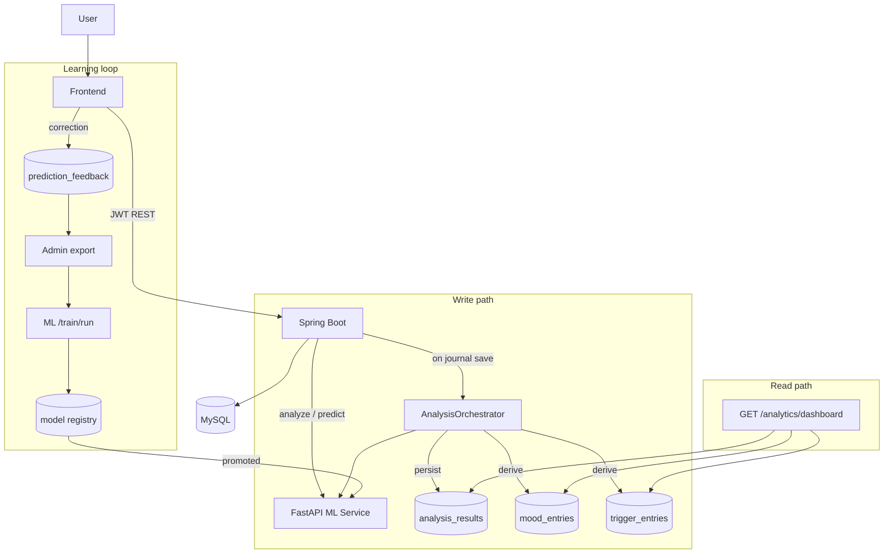

# ML Integration, Live Dashboard & Continuous Model Improvement — Implementation Plan

**Status:** Proposed — awaiting review
**Date:** 2026-08-11
**Scope:** `ml-service/`, `backend/`, `frontend/`, Flyway migrations `V9`–`V11`

---

## Table of Contents
- [1. Problem Statement](#1-problem-statement)
- [2. Goals & Non-Goals](#2-goals--non-goals)
- [3. Current-State Findings](#3-current-state-findings)
- [4. Target Architecture](#4-target-architecture)
- [5. Workstream A — Effective ML ↔ Backend ↔ Frontend Integration](#5-workstream-a--effective-ml--backend--frontend-integration)
- [6. Workstream B — Remove Hardcoded Dashboard Data](#6-workstream-b--remove-hardcoded-dashboard-data)
- [7. Workstream C — Deliberate User Data Collection](#7-workstream-c--deliberate-user-data-collection)
- [8. Workstream D — Continuous Learning from User Data](#8-workstream-d--continuous-learning-from-user-data)
- [9. Workstream E — Personalized Mindset Determination](#9-workstream-e--personalized-mindset-determination)
- [10. Database Migrations](#10-database-migrations)
- [11. API Contracts](#11-api-contracts)
- [12. Phased Delivery Plan](#12-phased-delivery-plan)
- [13. Testing Strategy](#13-testing-strategy)
- [14. Privacy, Consent & Safety](#14-privacy-consent--safety)
- [15. Risks & Mitigations](#15-risks--mitigations)
- [16. Open Decisions for Review](#16-open-decisions-for-review)

---

## 1. Problem Statement

Three concrete gaps drive this plan:

1. **The ML service is a dead-end call.** It is invoked only when a user explicitly presses "Analyze". Results are returned to the browser and then discarded — nothing is persisted, so no downstream feature (dashboard, analytics, mirror, reports, recovery plan) can use them. Writing a journal entry produces *zero* ML signal.
2. **The dashboard is largely fiction.** `frontend/src/pages/DashboardPage.tsx` renders hardcoded wellness scores, mood bars, trigger levels, "recent analysis" cards and progress meters. Only four tiles (streak, entry count, goals, active goals) are live. `MirrorPage.tsx` falls back to an invented `DEFAULT_RADAR` when the API returns nothing, so a brand-new account sees plausible-looking fabricated scores.
3. **User data never improves the model.** The classifier is trained once, at build time, on a template-generated synthetic corpus (`ml-service/app/seed_data.py`). Real user text and real user corrections are never fed back, and there is no model versioning, promotion gate, or rollback path.

---

## 2. Goals & Non-Goals

### Goals
- **G1** — Every user text submission (journal, social import, questionnaire free-text) is analyzed by the ML service and the result is **persisted**, versioned, and reusable.
- **G2** — The dashboard, mirror, analytics and reports render **only** real, user-derived data, with honest empty states when data is absent.
- **G3** — The app **actively and transparently collects** the inputs it needs: daily check-ins, journal prompts, questionnaire cadence, trigger confirmation, and prediction feedback.
- **G4** — User-contributed labeled examples feed a **retraining pipeline** with versioned artifacts, a quality gate, promotion and rollback.
- **G5** — "User mindset" is a **composite, personalized** determination — global model output calibrated against the individual's own baseline — not a raw classifier label.

### Non-Goals (this plan)
- Real OAuth social ingestion (covered by `SOCIAL_ACCOUNTS_IMPLEMENTATION_PLAN.md`).
- Transformer (XLNet/RoBERTa) fine-tuning — the interfaces are prepared for it; the training run itself is a follow-up.
- Clinical validation, diagnosis, or crisis intervention workflows.
- Multi-tenant / horizontal scaling of the ML service.

---

## 3. Current-State Findings

| Area | Finding | File |
|---|---|---|
| Journal | `create()` saves title/content/mood only. No ML call. | `application/service/JournalService.java` |
| Analysis | `analyzeJournal` / `analyzeSocial` are pass-throughs; nothing persisted. | `application/service/AnalysisService.java` |
| Social import | Analysis result crammed into `AssessmentSubmission` with `questionnaire_key = "social-import:<provider>"`, `answers` holding raw post text. Schema abuse. | `application/service/SocialAccountService.java` |
| Analytics | Derives everything from `mood_entries` + `trigger_entries`, both of which require **manual** logging that no UI currently prompts for. Empty for most users. | `application/service/AnalyticsService.java` |
| Weekly insights | `journalCount` is the user's **all-time** total, not the week's. | `AnalyticsService.weeklyInsights()` |
| Mood prediction | Uses **all** historical mood scores, not a recent window. | `AnalysisService.predictMood()` |
| Dashboard | `quickActions`, `recommendations`, `triggerSummary`, `progressItems` are module-level constants; wellness `82`, `78/100`, `+6%`, `"2h ago"`, and the 7-day mood bars are literals in JSX. | `pages/DashboardPage.tsx:14-38, 93-208` |
| Mirror | `DEFAULT_RADAR = [82, 68, 74, 79, 88, 71]` used as fallback. | `pages/MirrorPage.tsx:5` |
| ML resilience | `RestClient` with no timeout, no retry, no circuit breaker. A slow ML service blocks a Tomcat thread indefinitely. | `infrastructure/ml/MlServiceClient.java` |
| Model versioning | Single `models/pipeline.joblib`. No version identity, no history, no rollback. | `ml-service/app/ml_models.py` |
| Metrics passthrough | `MlServiceClient.modelMetrics()` silently drops `emotion_labels` and `dataset_profile` that the ML service returns and the Admin UI expects. | `MlServiceClient.ModelMetricsDto` |

---

## 4. Target Architecture



**Key principle:** the ML service stays stateless and owns *models*; the backend owns *user data and orchestration*; the frontend owns *presentation and consent UX*. The ML service never touches MySQL.

---

## 5. Workstream A — Effective ML ↔ Backend ↔ Frontend Integration

### A1. Persist every analysis (`analysis_results` table)

New domain entity `AnalysisResult` (migration **V9**) storing: `user_id`, `source_type` (`JOURNAL` | `SOCIAL` | `QUESTIONNAIRE` | `CHECKIN`), `source_id`, `sentiment`, `sentiment_score`, `dominant_emotion`, `emotion_scores` (JSON), `prediction`, `prediction_confidence`, `prediction_probabilities` (JSON), `reasons` (JSON), `detected_triggers` (JSON), `model_backend`, `model_version`, `analyzed_at`, `status` (`OK` | `FAILED` | `PENDING`).

Files:
- `domain/model/AnalysisResult.java`, `domain/repository/AnalysisResultRepository.java`
- `application/service/AnalysisOrchestrator.java` (new) — single entry point: `analyzeAndPersist(user, sourceType, sourceId, text)`

### A2. Analyze on write

- `JournalService.create()` / `update()` call `AnalysisOrchestrator` after the entry is saved.
- `SocialAccountService.importSocialContent()` writes to `analysis_results` instead of `assessment_submissions`. **Backfill migration V10** moves existing `social-import:*` rows across, then they are no longer written.
- Analysis runs **asynchronously** (`@Async` + a dedicated `ThreadPoolTaskExecutor`) so a slow ML service never blocks the journal save. The row is inserted `PENDING` and updated on completion; the frontend polls or re-fetches.
- Failures persist `status = FAILED` with the error message; a scheduled `AnalysisRetryJob` (fixed delay, max 3 attempts) reprocesses them.

### A3. Derive mood and triggers automatically

The core reason analytics is empty: nothing writes `mood_entries` or `trigger_entries`. After a successful journal analysis:
- Insert a `MoodEntry` with `mood_score = round((sentiment_score + 1) / 2 * 100)`, `mood_label = dominant_emotion`, `source = 'DERIVED'` (new column) — so derived and self-reported moods stay distinguishable and the user's own check-in always wins for a given day.
- Insert `TriggerEntry` rows from `detected_triggers`, `source = 'DERIVED'`, pending user confirmation (see C4).

### A4. Harden the ML client

In `infrastructure/ml/MlServiceClient.java`:
- Connect timeout 2 s, read timeout 8 s (configurable: `app.ml.connect-timeout-ms`, `app.ml.read-timeout-ms`).
- Retry once on connection failure / 5xx with 250 ms backoff.
- Resilience4j circuit breaker (`app.ml.circuit-breaker.*`); when open, return a degraded result flagged `model_backend = "unavailable"` rather than throwing 503 into a user-facing save.
- Propagate a `X-Correlation-Id` header, logged on both sides.
- Fix the DTO to carry `emotion_labels` and `dataset_profile` through to the Admin UI.
- Add `GET /api/v1/analysis/health` surfacing ML reachability + active model version for the Admin panel.

### A5. Batch endpoint

New ML endpoint `POST /analyze/batch` accepting up to 50 texts, so backfills and multi-post social imports are one round trip instead of N. Backend uses it in `AnalysisRetryJob` and social import.

### A6. Frontend wiring

- `lib/analysis.ts`: add `useAnalysisForEntry(entryId)`, `useRecentAnalyses(limit)`.
- `JournalPage`: after save, show an inline "Analyzing…" state, then reveal sentiment / emotion / prediction / top explanation factors with a **"Was this right?"** control (feeds Workstream D).
- `PredictionResultsPage`: read from persisted `analysis_results` instead of requiring a fresh analyze call, so results survive a page refresh.

---

## 6. Workstream B — Remove Hardcoded Dashboard Data

### B1. New aggregate endpoint

`GET /api/v1/analytics/dashboard` → `DashboardResponse`, assembled by a new `DashboardService`:

| Field | Derivation |
|---|---|
| `wellnessScore` | Composite (see Workstream E); `null` when insufficient data |
| `wellnessDelta` | Current 7-day composite minus prior 7-day composite; `null` if either window is empty |
| `wellnessUpdatedAt` | `max(analysis_results.analyzed_at, mood_entries.recorded_at)` |
| `summary.stress` / `.energy` / `.reflection` | Bucketed from trigger intensity, mood average, entries-per-week — each `null` when its source is empty |
| `moodWeek[7]` | Real per-day averages for the trailing 7 days, `null` for days with no data |
| `recentAnalyses[]` | Latest 3 `analysis_results` with a generated one-line narrative |
| `triggerSummary[]` | Top 3 categories by average intensity, with High/Medium/Low band |
| `recommendations[]` | Top 3 incomplete `RecoveryAction` rows for the user |
| `progressItems[]` | Mood stability (inverse stdev), reflection consistency (days journaled / 14), recovery habits (% actions completed) |
| `dataCompleteness` | `{ hasJournal, hasMood, hasAssessment, hasTriggers, daysOfData }` — drives onboarding prompts |

Single query round per repository; target < 150 ms P95.

### B2. Delete the constants

Remove `recommendations`, `triggerSummary`, `progressItems`, the literal `82` / `78/100` / `+6%` / `"2h ago"`, and the gradient mood bars from `DashboardPage.tsx`. `quickActions` is navigation, not data — it stays.

Replace the hardcoded welcome sentence with copy generated from real state (e.g. "You've logged 4 reflections this week" / "Let's get your first reflection down").

### B3. Honest empty states

- `MirrorPage`: delete `DEFAULT_RADAR`; render a "Not enough data yet" panel plus a CTA when `radar` is empty. Never display a number the user's data did not produce.
- Every dashboard card gets three states: **loading** (skeleton), **empty** (CTA to the action that fills it), **populated**.
- Reuse `components/feedback/EmptyState.tsx` and `Skeleton.tsx`.

### B4. Related correctness fixes

- `AnalyticsService.weeklyInsights()` — scope `journalCount` to the trailing 7 days.
- `AnalysisService.predictMood()` — pass only the trailing 30 entries.
- `AnalyticsService` heatmap/series use `ZoneOffset.UTC`; add a user `timezone` field (Workstream C) and bucket by the user's local day.

---

## 7. Workstream C — Deliberate User Data Collection

The app currently has no UI that writes `mood_entries` or `trigger_entries`. Add explicit, low-friction collection.

### C1. Daily check-in (highest value, lowest friction)
New `CheckInCard` on the dashboard, shown once per local day: 1–5 mood faces + optional one-line note + optional energy/sleep sliders. Posts to the existing `POST /api/v1/mood` with `source = 'SELF_REPORTED'`. The note, when present, is analyzed and stored as an `analysis_results` row with `source_type = CHECKIN`.

### C2. Onboarding baseline
After registration, a 4-step wizard (skippable, resumable): timezone + reminder time → short baseline questionnaire → 2–3 focus areas → consent choices (Workstream D/§14). Persisted to a new `user_profile_preferences` table (V9). Establishes the personal baseline used in Workstream E.

### C3. Journal prompts
Rotating prompt chips above the editor ("What drained you today?", "What went better than expected?"). Prompt id stored on the entry so we can later measure which prompts yield the richest signal.

### C4. Trigger confirmation
Auto-detected triggers appear as chips after analysis: **Confirm** / **Dismiss** / **Adjust intensity**. Confirmed triggers flip `source` to `USER_CONFIRMED` — these are high-quality labels, and dismissals are equally valuable negative signal for the trigger lexicon.

### C5. Questionnaire cadence
Nudge a re-assessment every 14 days; surface a trend line across submissions on `AnalyticsPage`.

### C6. Reminder follow-through
`lib/settings.ts` already stores a reminder preference but nothing schedules it. Wire an actual daily browser notification at the user's chosen time, driven by a service worker registration.

**Friction guard:** every collection surface is dismissible, never modal-blocking, and the app must remain fully usable by a user who declines all of it (empty states from B3 cover this).

---

## 8. Workstream D — Continuous Learning from User Data

### D1. Terminology correction

The deployed model is **TF-IDF + Random Forest**, which cannot be incrementally fine-tuned — sklearn tree ensembles have no `partial_fit`. What we will build is a **periodic retraining pipeline on an augmented corpus** (synthetic seed + user-contributed labeled examples), plus an optional `SGDClassifier` path that *does* support true incremental `partial_fit` for rapid adaptation between full retrains. Transformer fine-tuning remains a later phase behind the same interface. This distinction matters for expectation-setting and for how often retraining runs.

### D2. Label sources

| Source | Signal quality | Volume |
|---|---|---|
| Explicit prediction correction ("Not quite — I'd say *anxiety*") | **Highest** — direct supervised label | Low |
| Thumbs up on a prediction | High (confirms the predicted label) | Medium |
| Confirmed/dismissed trigger chips | High (trigger lexicon, not state classifier) | Medium |
| Self-reported check-in mood vs. same-day journal text | Medium — weak label via mood→state mapping | High |
| Questionnaire severity vs. contemporaneous journal text | Medium | Medium |

New table `prediction_feedback` (V9): `user_id`, `analysis_result_id`, `predicted_label`, `corrected_label`, `agreement` (`AGREE`|`DISAGREE`|`PARTIAL`), `comment`, `created_at`.
New endpoint `POST /api/v1/analysis/{id}/feedback`.

### D3. Training-data export

Admin-only `GET /api/v1/admin/training-data/export?since=&minConfidence=&consentOnly=true` returning JSONL:

```json
{"text":"...","label":"anxiety","source":"user_correction","weight":1.0,"user_hash":"sha256:...","created_at":"..."}
```

Rules — **all enforced server-side, not in the ML service**:
- Only rows from users who opted in (§14).
- `user_id` replaced by a salted hash; no email, name, or entry title ever leaves the backend.
- PII scrub pass (emails, phone numbers, URLs, @handles) before export.
- Minimum length filter (≥ 20 characters) and near-duplicate suppression.
- Per-user cap (e.g. 200 examples) so one prolific user cannot dominate the corpus.

### D4. ML service training pipeline

New `ml-service/app/training/` package:

```
training/
  corpus.py      # merge synthetic seed + user JSONL, dedupe, stratify, class-balance
  runner.py      # train, evaluate on a frozen holdout, write versioned artifacts
  registry.py    # version metadata, active pointer, promote / rollback
  quality.py     # promotion gate
```

Artifacts move from `models/pipeline.joblib` to:

```
models/
  registry.json                    # {active: "v3", versions: [...]}
  versions/
    v1/{pipeline.joblib,metrics.json,corpus_manifest.json}
    v2/...
```

New endpoints:
- `POST /train/run` — body: `{corpus_url|inline_jsonl, base:"seed+user", algorithm:"random_forest"}` → returns `job_id`, runs in a background task.
- `GET /train/status/{job_id}`
- `GET /models/versions` — list with metrics
- `POST /models/promote` — `{version}` (gated)
- `POST /models/rollback` — `{version}`
- `GET /models/active`

`ml_models.py` is refactored to load from the registry's active pointer and to hot-swap on promotion (guarded by the existing `_lock`), so no restart is required. Every prediction response gains `model_version`.

### D5. Promotion gate (`quality.py`)

A newly trained version is promoted **only if all hold** against a **frozen holdout set that never includes user data** (so the benchmark stays stable across retrains):

1. `accuracy >= active.accuracy - 0.01` (no meaningful regression)
2. `f1_macro >= active.f1_macro - 0.01`
3. No single class F1 drops below 0.50
4. Corpus contains ≥ 200 user examples and ≥ 30 per class
5. Prediction distribution shift vs. active model < 15 percentage points on the holdout (catches collapse to a majority class)

Failures are recorded in the registry with the reason and require explicit admin override to promote.

### D6. Orchestration

- Manual trigger from the Admin panel: **Retrain** button → export → `/train/run` → live status → metrics comparison table → **Promote** / **Discard**.
- Scheduled weekly job (`@Scheduled`, disabled by default via `app.ml.training.scheduled-enabled=false`) that runs export + train and *stops at the gate*, leaving promotion as a human decision.
- Full audit trail in `model_training_runs` (V11): who triggered, corpus size, metrics, gate outcome, promotion decision.

### D7. Feedback-loop safety

Model output influences what users see, which influences what they report, which trains the next model. Mitigations:
- Weight explicit corrections above model-agreeing signals when building the corpus.
- Never train on labels the model itself generated with no human touch.
- Keep the synthetic seed corpus permanently in the mix as an anchor.
- Track per-version drift in the prediction distribution and alert on a sharp shift.

---

## 9. Workstream E — Personalized Mindset Determination

A global classifier says "this text reads as *stress*". It cannot say "this is unusual **for you**". Personalization is a calibration layer on top, not a per-user model.

### E1. Personal baseline
`user_baselines` table (V9), recomputed nightly per user after ≥ 14 days of data: mean/stdev of sentiment score, mood score, per-state prediction rate, journaling cadence. Cold-start uses cohort averages, clearly labeled "building your baseline".

### E2. Composite mindset score
```
mindset = w1·sentimentTrend + w2·moodTrend + w3·(1 − triggerLoad)
        + w4·assessmentScore + w5·recoveryEngagement
```
Default weights `0.25 / 0.25 / 0.20 / 0.20 / 0.10`, defined as named constants in `MindsetScoringService`, with each component's contribution returned to the client so the score is explainable — consistent with the app's explainability posture. Components with no data are dropped and the remaining weights renormalized; if fewer than two components are available the score is `null`, not a guess.

### E3. Deviation-based insight
Report *z-scores against the user's own baseline*: "Your sentiment this week is 1.4σ below your normal range" rather than a bare label. This is the honest, defensible framing for a non-clinical tool.

### E4. Surfacing
`GET /api/v1/analytics/mindset` → `{ score, band, components[], baseline, deviation, confidence, dataCompleteness }`, consumed by the dashboard hero card, `MirrorPage`, and the reports summary — replacing the current wellness heuristics in `AnalyticsService` and `ReportService` so all three agree on one number.

---

## 10. Database Migrations

**V9 — `analysis_and_personalization_schema.sql`**
- `analysis_results` — indexes on `(user_id, analyzed_at DESC)`, `(user_id, source_type)`, `(status)`
- `prediction_feedback` — index `(user_id, created_at)`, FK to `analysis_results`
- `user_baselines` — unique on `user_id`
- `user_profile_preferences` — timezone, reminder time, focus areas, **consent flags**
- `ALTER TABLE mood_entries ADD COLUMN source VARCHAR(24) NOT NULL DEFAULT 'SELF_REPORTED'`
- `ALTER TABLE trigger_entries ADD COLUMN source VARCHAR(24) NOT NULL DEFAULT 'USER_LOGGED'`
- `ALTER TABLE journal_entries ADD COLUMN prompt_id VARCHAR(64) NULL`

**V10 — `backfill_social_analysis.sql`** — migrate `assessment_submissions` rows where `questionnaire_key LIKE 'social-import:%'` into `analysis_results`, then delete them.

**V11 — `model_training_runs.sql`** — training run audit table.

All migrations forward-only and idempotent (`IF NOT EXISTS`), matching the existing V1–V8 style. JSON columns use MySQL 8 native `JSON`.

---

## 11. API Contracts

### Backend (new / changed)

| Method | Path | Purpose |
|---|---|---|
| `GET` | `/api/v1/analytics/dashboard` | Full dashboard payload (B1) |
| `GET` | `/api/v1/analytics/mindset` | Composite mindset score (E4) |
| `GET` | `/api/v1/analysis/results?sourceType=&limit=` | Persisted analyses |
| `GET` | `/api/v1/analysis/results/{id}` | Single analysis |
| `POST` | `/api/v1/analysis/{id}/feedback` | Prediction correction (D2) |
| `GET` | `/api/v1/analysis/health` | ML reachability + active model version |
| `GET` | `/api/v1/me/preferences` · `PATCH` | Timezone, reminders, focus areas, consent |
| `POST` | `/api/v1/checkin` | Daily check-in (thin wrapper over mood + optional note analysis) |
| `GET` | `/api/v1/admin/training-data/export` | JSONL export (admin) |
| `POST` | `/api/v1/admin/models/retrain` | Trigger retrain (admin) |
| `GET` | `/api/v1/admin/models/versions` | Version list + metrics (admin) |
| `POST` | `/api/v1/admin/models/promote` · `/rollback` | Promotion control (admin) |

All responses keep the existing `ApiResponse` envelope. Admin routes remain behind `ROLE_ADMIN` in both `SecurityConfig` and `@PreAuthorize`.

### ML service (new / changed)

| Method | Path | Purpose |
|---|---|---|
| `POST` | `/analyze/batch` | Up to 50 texts per call |
| `POST` | `/train/run` · `GET /train/status/{id}` | Retraining jobs |
| `GET` | `/models/versions` · `/models/active` | Registry reads |
| `POST` | `/models/promote` · `/models/rollback` | Registry writes |
| — | *all analyze/predict responses* | Gain `model_version` |

The ML service remains **internal-only** — not exposed publicly, reachable only from the backend network. Training endpoints additionally require a shared secret header (`app.ml.training-token`), since promotion is a privileged operation.

---

## 12. Phased Delivery Plan

Each phase is independently shippable and leaves the app in a working state.

### Phase 1 — Persist and integrate *(foundation)*
V9 migration · `AnalysisResult` entity + repository · `AnalysisOrchestrator` · async executor + retry job · journal/social write path · `MlServiceClient` hardening (timeouts, retry, circuit breaker, correlation id, DTO fix) · `/analyze/batch`.
**Exit:** a saved journal entry produces a persisted, retrievable analysis; ML downtime never fails a journal save.

### Phase 2 — Live dashboard
`DashboardService` + `/analytics/dashboard` · derived mood/trigger writes · rewrite `DashboardPage` with loading/empty/populated states · remove `DEFAULT_RADAR` from `MirrorPage` · weekly-insights and mood-window fixes.
**Exit:** grep for hardcoded metrics in `pages/` returns nothing; a fresh account shows empty states, not fabricated numbers.

### Phase 3 — Data collection
Check-in card · onboarding wizard + preferences (incl. timezone and consent) · journal prompts · trigger confirmation chips · questionnaire cadence · working daily reminders.
**Exit:** a new user can reach a fully populated dashboard within 7 days of normal use.

### Phase 4 — Feedback capture
`prediction_feedback` table + endpoint · "Was this right?" UI on journal, social analysis, and prediction-results pages · admin feedback review screen.
**Exit:** labeled corrections accumulate; admin can see volume and class distribution.

### Phase 5 — Retraining pipeline
`ml-service/app/training/` · model registry + versioning + hot swap · `/train/*` and `/models/*` endpoints · admin export with PII scrub and consent filter · promotion gate · Admin retrain/promote/rollback UI · `model_training_runs` audit (V11).
**Exit:** an admin can retrain from real user data, compare metrics against the active version, and promote or roll back — with a full audit trail.

### Phase 6 — Personalization
`user_baselines` + nightly recompute · `MindsetScoringService` · `/analytics/mindset` · deviation-based insight copy · unify wellness scoring across dashboard, mirror, and reports.
**Exit:** one explainable mindset number, personalized to each user's own baseline, consistent everywhere it appears.

---

## 13. Testing Strategy

**Backend (JUnit + Mockito; current coverage is 3 test classes — this plan roughly triples it)**
- `AnalysisOrchestratorTest` — persistence, derived mood/trigger creation, `FAILED` path, retry cap
- `DashboardServiceTest` — empty user → all-null payload with no fabricated defaults; populated user → correct aggregates; delta with one empty window
- `MindsetScoringServiceTest` — weight renormalization when components are missing, `null` below the two-component threshold
- `MlServiceClientTest` — timeout, retry-once, circuit-breaker-open degraded path (MockWebServer)
- `TrainingDataExportServiceTest` — consent filter, PII scrub, per-user cap, dedupe

**ML service (pytest)**
- `test_registry.py` — promote, rollback, active pointer, concurrent load safety
- `test_quality_gate.py` — each of the five gate conditions passes and fails as specified
- `test_corpus.py` — merge, dedupe, class balance, seed anchor always present
- `test_batch.py` — batch parity with single-text results, 50-item cap

**Frontend (Vitest)**
- `DashboardPage.test.tsx` — renders empty states with no data; no hardcoded numbers in the empty tree
- `MirrorPage.test.tsx` — no radar values rendered when the API returns empty
- `useAnalysis` hooks — pending → resolved transitions

**Integration / manual**
- Fresh-account walkthrough: register → onboarding → check-in → journal → verify every dashboard card transitions from empty to populated with values traceable to the input.
- ML-service-down walkthrough: journal save succeeds, analysis lands `PENDING`, retry job completes it once the service returns.

---

## 14. Privacy, Consent & Safety

Journal entries are among the most sensitive text a person writes. Using them as training data is a materially different act from analyzing them for the author's own benefit, and the plan treats it that way:

- **Separate, explicit, opt-in consent** for training use — default **off**, never bundled with the terms of service, presented in plain language during onboarding and revocable at any time in Settings.
- **Revocation is retroactive**: withdrawing consent removes the user's examples from future corpora. Already-trained models are not retroactively purged (technically infeasible); this limitation is stated plainly in the consent copy rather than glossed over.
- **Analysis for the user's own benefit does not require training consent** — declining training must not degrade the product.
- **Pseudonymization + PII scrub** on export (§D3); raw text never leaves the backend un-scrubbed and the ML service never receives user identifiers.
- **Data export and deletion**: `GET /api/v1/me/export` (all personal data as JSON) and account deletion cascading across all new tables — both needed for GDPR-style obligations and both cheap to add now versus retrofitting later.
- **Retention**: raw text in `analysis_results` retained 24 months by default, configurable; derived scores retained indefinitely.
- **Crisis-signal handling**: the classifier will encounter self-harm language. It must **not** silently pass it through as a routine "depression" label. Add a lexicon-based safety check that surfaces the existing Emergency Help resources non-intrusively. This is explicitly *not* a clinical intervention and the existing "not a medical device" disclaimer stays prominent.
- **No training on crisis-flagged content** without separate review.

---

## 15. Risks & Mitigations

| Risk | Impact | Mitigation |
|---|---|---|
| Synthetic seed corpus doesn't match real user language; accuracy drops when real data enters | High | Frozen holdout benchmark; gate on regression; keep seed as anchor; expect and monitor the first real-data retrain closely |
| Too few user corrections to retrain meaningfully | High | Gate requires ≥ 200 examples / ≥ 30 per class; until then the pipeline exists but simply doesn't promote — no harm |
| Feedback loop: model shapes user reports, which train the model | Medium | §D7 — weight explicit corrections, never train on unreviewed model output, monitor distribution drift |
| Async analysis makes the UI feel disconnected | Medium | Optimistic "Analyzing…" state, poll every 2 s for 20 s, then a retry affordance |
| Derived mood entries pollute self-reported data | Medium | `source` column; self-reported always wins per day; analytics can filter |
| Users decline training consent en masse | Medium | Design for it — the app is fully functional without it; retraining simply waits for volume |
| Retraining regresses production quality | High | Promotion gate + one-click rollback + versioned artifacts + audit trail |
| Dashboard aggregate query gets slow | Low | Indexes in V9; single round per repository; add a 60 s cache if P95 exceeds 150 ms |
| Scope: six phases is a large body of work | Medium | Every phase is independently shippable; Phases 1–2 alone resolve the two most visible problems |

---

## 16. Open Decisions for Review

1. **Retraining cadence** — weekly scheduled export+train with manual promotion (recommended), or fully manual until volume justifies automation?
2. **Derived mood entries** — write them automatically (recommended: yes, with `source` distinction), or require user confirmation before they count toward analytics?
3. **Training consent default** — hard opt-in (recommended) vs. opt-in prompt shown repeatedly until answered?
4. **`SGDClassifier` incremental path** — build it in Phase 5, or defer until the batch retrain loop has proven itself?
5. **Crisis-signal handling** — is surfacing the existing Emergency Help resources the right scope, or is even that beyond what this project should do?
6. **Phase ordering** — Workstream D (Phases 4–5) is the largest investment but delivers value only once feedback volume accumulates. Ship Phases 1–3 first and revisit, or commit to all six now?

---

## Appendix — Files Touched (estimate)

**New (~34):** `AnalysisResult` + repo · `AnalysisOrchestrator` · `DashboardService` + DTO · `MindsetScoringService` · `UserBaseline` + repo · `PredictionFeedback` + repo + controller · `UserPreferences` + repo + controller · `CheckInController` · `TrainingDataExportService` · `ModelRegistryController` · `AnalysisRetryJob` · `BaselineRecomputeJob` · V9/V10/V11 migrations · `ml-service/app/training/{corpus,runner,registry,quality}.py` · frontend `CheckInCard` · `OnboardingWizard` · `PredictionFeedbackControl` · `lib/dashboard.ts` · `lib/mindset.ts` · `lib/preferences.ts` · ~12 test files.

**Modified (~18):** `JournalService` · `SocialAccountService` · `AnalysisService` · `AnalyticsService` · `ReportService` · `AdminService` · `MlServiceClient` · `MlAnalysisPort` · `AnalysisController` · `AnalyticsController` · `AdminController` · `application.yml` · `ml-service/app/{main,ml_models,schemas}.py` · `DashboardPage.tsx` · `MirrorPage.tsx` · `JournalPage.tsx` · `AdminAnalyticsPage.tsx` · `SettingsPage.tsx`.
